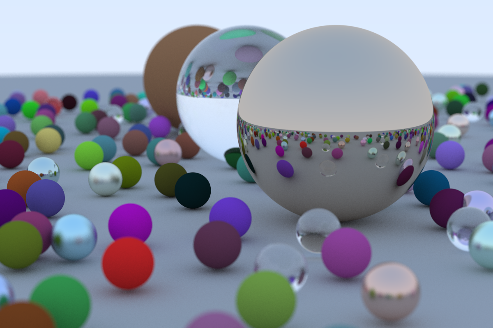

# Ray Tracing in One Weekend
https://raytracing.github.io/books/RayTracingInOneWeekend.html

## Completed
- [x] 1\. Overview
- [x] 2\. Output an image
- [x] 3\. The vec3 class
- [x] 4\. Rays, a Simple Camera, and Background
- [x] 5\. Adding a Sphere
- [x] 6\. Surface Normals and Multiple Objects
- [x] 7\. Antialiasing
- [x] 8\. Diffuse Materials
- [x] 9\. Metal
- [x] 10\. Dielectrics
- [x] 11\. Positionable Camera
- [x] 12\. Defocus Blur
- [x] 13\. Where Next?

## Requirements
- C++ compiler supporting C++20 standard
- CMake >= 3.24
- Conan >= 1.54

## Usage
```bash
git clone https://github.com/BenjikQ/RayTracingInOneWeekend.git
cd RayTracingInOneWeekend
mkdir build
cd build
conan install .. -pr:h <profile> -pr:b <profile> --build missing
cmake -DCMAKE_BUILD_TYPE=Release -S .. -B . -G "<generator>" -DCMAKE_C_COMPILER=<compiler> -DCMAKE_CXX_COMPILER=<compiler>
cmake --build .
./src/raytracer
```

## Result

